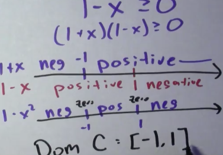
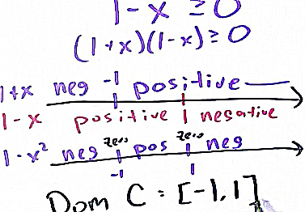

Scanify
=========================================

Usage
---------------------------------------

    $ ./scanify.py test_data/calculusone.png
    test_data/calculusone_scan.png save
    
From

to 

Install
---------------------------------------

**imagemagick required**

Credits
---------------------------------------
http://tex.stackexchange.com/questions/94523/simulate-a-scanned-paper

Resize
=========================================

Resize, to 50% of a orignal file.
	
	$ resize.py *
	IMG_0426_resized50p.png save
    IMG_0427_resized50p.png save
    IMG_0428_resized50p.png save
    IMG_0429_resized50p.png save

to get:

    -rwxr-xr-x@ 1 magnus  staff   1.7M Mar 25 12:43 IMG_0426.PNG
    -rw-r--r--  1 magnus  staff   323K Mar 25 12:58 IMG_0426_resized50p.png
    -rwxr-xr-x@ 1 magnus  staff   375K Mar 25 12:43 IMG_0427.PNG
    -rw-r--r--  1 magnus  staff    96K Mar 25 12:58 IMG_0427_resized50p.png
    -rwxr-xr-x@ 1 magnus  staff   457K Mar 25 12:43 IMG_0428.PNG
    -rw-r--r--  1 magnus  staff   156K Mar 25 12:58 IMG_0428_resized50p.png
    -rwxr-xr-x@ 1 magnus  staff   409K Mar 25 12:47 IMG_0429.PNG
    -rw-r--r--  1 magnus  staff   156K Mar 25 12:58 IMG_0429_resized50p.png

History
=========================================

- 170325 add a simple resize script
